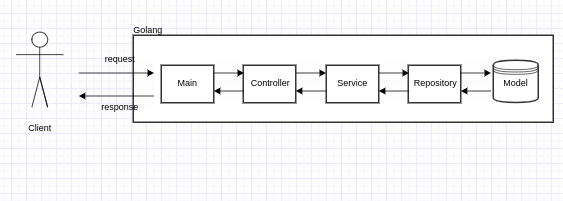

## Go언어 RestAPI 연습

### Project
#### Architecture

- main  → mux.NewRouter()를 이용하여 요청 Handler 역할
- controller → main을 통하여 요청을 받아서 응답설정
- application → 비즈니스 로직 및 데이터 추출
- repository → 실제 데이터 저장 및 삭제 등 실행
- model → 데이터 저장소 

#### 데이터 저장 방식 - database - x
- 배열로 data저장 (휘발성)
- Board 객체 생성 ( Id, title, text, writer)

### Overview
1. 데이터 생성, 삭제, 수정, 조회, 전체 조회 한다. 
2. 데이터 생성 시 빈 문자열이 존재하면 안된다. 
3. 데이터 수정 시 빈 문자열은 무시한다. 
4. 중복된 데이터(제목)을 허용하지 않는다. 
   - 수정시 자신의 게시글 제목 이외의 중복된 제목 허용 x 
5. 올바르지 않은 데이터 요청 시 404 에러 및 메시지 출력한다.

### Using Library
#### encoding/json
응답을 보낼 때 json 형태로 바꿔서 메세지 응답을 보내준다
json 형태로 request 요청이 들어오면 class에 변수에 맞게 대입 시켜주는 준다

#### net/http
go 언어에서 제공하는 http 웹 요청 메세지 라이브러리
http.Handle, Http.ListenAndServer, Http.Request, Http.Response 등 요청과 응답 및 요청상태 대기 등 제어해준다.

#### strconv
문자열 형 변환 라이브러리
라이브러리 중에 문자열을 숫자로 바꿔주는 strconv.Atoi ,
숫자를 문자열로 바꿔주는 strconv.Itoa 사용하였다.

#### github.com/gorilla/mux
go 언어에서는 깃을 통하여 라이브러리를 import 할 수 있다.
mux 라이브러리를 사용하여 PathVariable값을 쉽게 구할 수 있다.
REST API를 더 쉽게 해주는 라이브러리로 보면 된다.

#### strings
문자열 포함 및 비교등 문자열 라이브러리

### RestAPI Information
#### Response Information
Header Information
- Content-Type : application/json

#### GET
- ReadAll() : http://localhost:8080/boards
- ReadById() : http://localhost:8080/boards/{id}
- 요청정보 완료 메시지 : 200 OK
- 요청정보 에러 메시지 : 404 error

#### POST
- Create() : http://localhost:8080/boards
- 요청정보 완료 메시지 : 201 created
- 요청정보 에러 메시지 : 400 error

#### PATCH
- ModifyById : http://localhost:8080/boards/{id}
- 요청정보 완료 메시지 : 200 OK
- 요청정보 에러 메시지 : 404 error , 400 error

#### DELETE
- DeleteById : http://localhost:8080/boards/{id}
- 요청정보 완료 메시지 : 200 OK
- 요청정보 에러 메시지 : 404 error